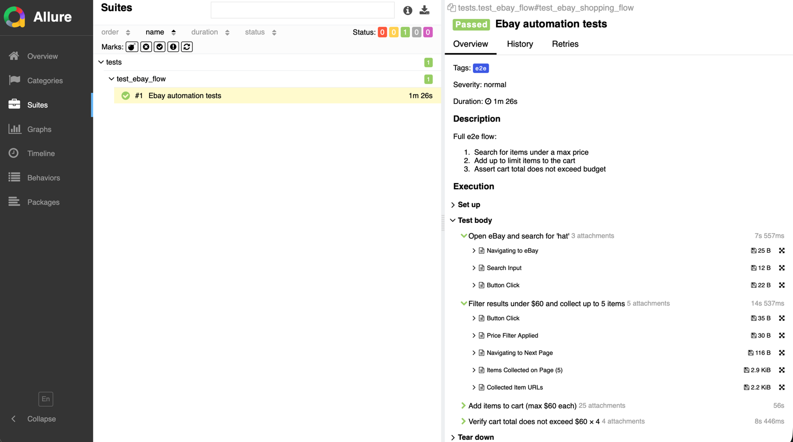
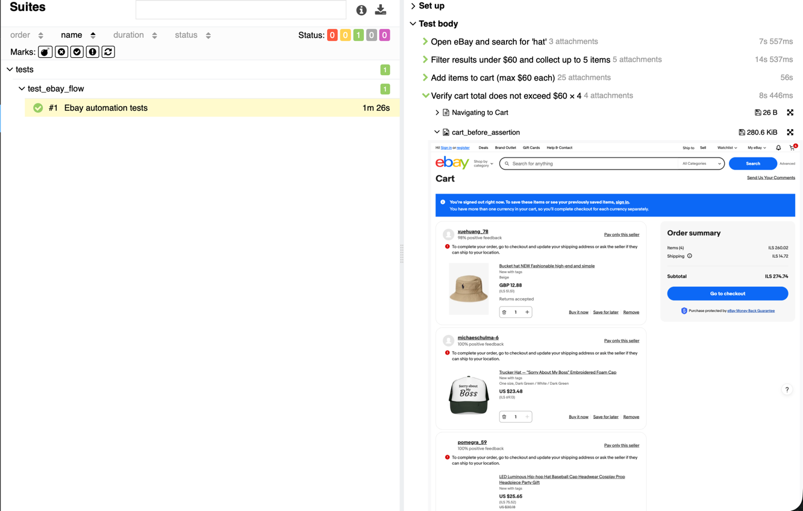

# EbayAutomation

An end-to-end automation project for eBay shopping flows using Python and Playwright.

The test searches for items under a given price, adds them to the cart with random variant selection, and verifies the cart total stays within budget.

## Prerequisites

Python 3.12+ and pip installed. To install dependencies:

```bash
pip install -r requirements.txt
playwright install chromium
```

To view Allure reports you'll also need the Allure CLI:

```bash
brew install allure
```

## Configuration

Edit `data/test_data.json` to change the search query, max price, and item limit:

```json
{
  "search_query": "shoes",
  "max_price": 220,
  "limit": 2,
  "base_url": "https://www.ebay.com"
}
```

## Running the tests

Basic run with a simple HTML report:

```bash
pytest tests/test_ebay_flow.py -v -s
```

Run with Allure report (recommended):

```bash
pytest tests/test_ebay_flow.py -v -s --alluredir=reports/allure-results
allure serve reports/allure-results
```

The Allure command opens an interactive report in your browser automatically.

## Project structure

```
EbayAutomation/
├── pages/          Page Object Model classes
├── tests/          Test files
├── utils/          Shared helpers (price parser, screenshots)
├── data/           Test input data
└── reports/        Generated reports and screenshots
```

The single test in `tests/test_ebay_flow.py` orchestrates four page objects in sequence:
`HomePage` (navigate + search) → `SearchResultsPage` (apply price filter, collect item URLs across pages) → `ItemPage` (select variants, add each item to cart) → `CartPage` (read subtotal, assert it stays within budget).
All pages inherit from `BasePage` (shared navigation/wait helpers). Shared logic lives in `utils/`: `price_parser` converts prices between currencies, `screenshot_helper` saves PNGs and attaches them to Allure, `logger` writes every log to both the console and the Allure report simultaneously.
Test inputs (`search_query`, `max_price`, `limit`, `base_url`) come from `data/test_data.json` and are injected via a pytest session fixture in `conftest.py`.

## Report retention

At the **start of every test session** the suite automatically cleans up old report data:

- **Allure results** — `reports/allure-results/` is wiped before each run so the Allure report always shows only the current session, with no mixing of historical runs.
- **Screenshots** — files in `reports/screenshots/` are grouped into runs by a 30-minute idle gap between files. Only the **last 10 runs** are kept; older screenshots are deleted automatically.

To change the retention limit, edit `_KEEP_RUNS` at the top of `conftest.py`.

## Notes

eBay may occasionally trigger a CAPTCHA when accessing the cart. This is a known limitation of guest sessions and is outside the scope of this project. If it happens, wait a few minutes and run again.

## Limitations

The test runs as a guest user (no login required). Prices in the test data are in USD. The price parser automatically converts ILS (Israeli Shekel) prices to USD using a live exchange rate, so the `max_price` in `test_data.json` should always be set in dollars.

Some items on eBay may not ship to certain regions, which can cause the cart to show fewer items than expected. This is an eBay platform limitation.

## Screenshots from allure reports

Test run and logs the flow, to the report/allure, taking screenshots per the requirements like added item and total cart.



